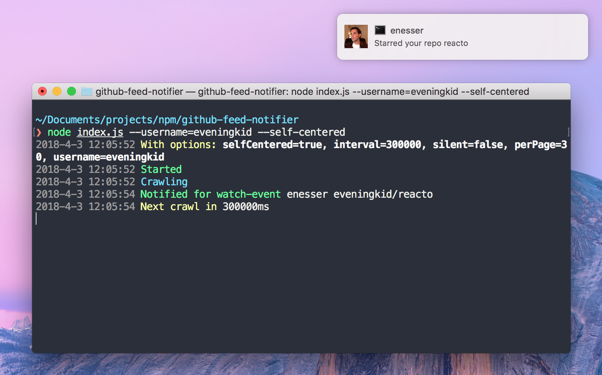

<p align="center">
  
</p>

Get notified whenever something happens in someone's public github feed:
- someone stars a repo
- **todo:** someone forks a repo

```
github-feed --username=eveningkid --self-centered
```

## Install
```
npm install -g github-feed
```
```
yarn add global github-feed
```
Alternative installation: `npx github-feed --username=eveningkid`.

## Parameters
- `username:string`, define which user's feed to crawl
- `selfCentered:bool=false`, if *true* will only notify for *username* repos
- `interval:number=300000`, interval between each crawl in ms
- `silent:bool=false`, to log or not to log
- `perPage:number=30`, how many results per page for each crawl request

## License
[eveningkid](https://twitter.com/eveningkid) @ MIT
